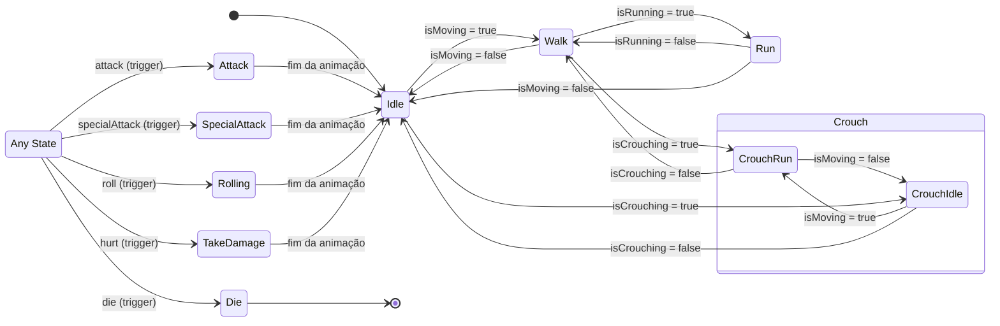

# Barbarians

Jogo 2D top-down desenvolvido em Unity, com o comportamento do personagem controlado por uma **Máquina de Estados Finitos (FSM)** implementada no Animator.

O personagem possui animações em 8 direções (4 retas + 4 diagonais) para cada ação, organizadas em Blend Trees.

---

## Vídeo da gameplay

🎥 **Link:** [assistir no YouTube](https://youtu.be/zQCcJEzbMaw)

O vídeo demonstra todas as animações do personagem e as transições entre os estados da máquina.

---

## Máquina de Estados Finitos

### Diagrama



### Descrição dos estados

| Estado | Descrição |
|---|---|
| **Idle** | Estado inicial. O personagem está parado, olhando para a última direção em que se moveu. |
| **Walk** | Movimento em velocidade normal, em qualquer uma das 8 direções. |
| **Run** | Movimento acelerado. Só é alcançado a partir do Walk. |
| **CrouchIdle** | Agachado e parado. |
| **CrouchRun** | Agachado e em movimento, com velocidade reduzida. |
| **Attack** | Ataque na direção em que o personagem está olhando. O movimento é bloqueado durante a animação. |
| **SpecialAttack** | Ataque especial, com comportamento idêntico ao Attack, porém com animação e tecla próprias. |
| **Rolling** | Rolamento na direção em que o personagem está olhando. Ao terminar a animação, a máquina retorna ao Idle. |
| **Take Damage** | Reação ao dano causado pela colisão com um inimigo. |
| **Die** | **Estado terminal**: não possui nenhuma transição de saída. Uma vez alcançado, a máquina permanece nele até a cena ser recarregada. |

### Parâmetros do Animator

| Parâmetro | Tipo | Função |
|---|---|---|
| `moveX`, `moveY` | Float | Direção atual do movimento. Alimentam os Blend Trees de Walk, Run e CrouchRun. |
| `lastX`, `lastY` | Float | Última direção em que o personagem se moveu. Alimentam os Blend Trees de Idle, CrouchIdle, Attack, Hurt e Die, garantindo que o personagem continue voltado para o lado correto quando parado. |
| `isMoving` | Bool | Indica se há input de direção. Alterna entre os estados parados e em movimento. |
| `isRunning` | Bool | Verdadeiro enquanto o jogador segura Shift **e** está em movimento. |
| `isCrouching` | Bool | Verdadeiro enquanto o personagem está agachado. |
| `attack` | Trigger | Dispara o estado de ataque. |
| `specialAttack` | Trigger | Dispara o estado de ataque especial. |
| `roll` | Trigger | Dispara o estado de rolamento. |
| `hurt` | Trigger | Dispara o estado de dano. |
| `die` | Trigger | Dispara o estado de morte. |

---

## Controles

| Ação | Tecla | Descrição |
|---|---|---|
| **Mover** | `W` `A` `S` `D` ou `↑` `←` `↓` `→` | Move o personagem nas 8 direções. Pressionar duas teclas simultaneamente (ex.: `W` + `D`) resulta em movimento diagonal. O vetor de input é normalizado, para que a velocidade na diagonal seja igual à das direções retas. |
| **Correr** | `Shift` esquerdo *(segurar)* | Aumenta a velocidade enquanto a tecla estiver pressionada. Só tem efeito se o personagem estiver em movimento; pressionar Shift parado não altera o estado. Não funciona enquanto agachado. |
| **Agachar** | `Ctrl` esquerdo | Alterna entre agachado e em pé. Agachado, o personagem continua podendo se mover, porém com velocidade reduzida. O agachamento tem prioridade sobre a corrida: se Shift e Ctrl forem pressionados juntos, o personagem permanece agachado. |
| **Atacar** | `X` | Executa o ataque na direção em que o personagem está olhando. O movimento fica bloqueado até o fim da animação, e novos ataques são ignorados durante esse período. |
| **Ataque especial** | `F` | Executa o ataque especial, seguindo a mesma lógica do ataque comum: ocorre na direção em que o personagem está olhando e bloqueia o movimento até o fim da animação. |
| **Rolar** | `Espaço` | Executa o rolamento na direção em que o personagem está olhando. O estado é acionado por trigger e se encerra automaticamente ao término da animação. |
| **Tomar dano** | *(colisão)* | O estado de dano não possui tecla: ele é acionado automaticamente ao colidir com um objeto marcado com a tag `Enemy`. Após sofrer dano, o personagem fica invulnerável por 1 segundo, evitando que a animação reinicie a cada frame enquanto permanecer encostado no inimigo. |
| **Morrer** | `K` | Aciona o estado de morte. Por se tratar de uma demonstração da máquina de estados, a morte é disparada diretamente por uma tecla. Após a morte, todos os demais comandos são ignorados. |

---

## Como executar

1. Clone o repositório:
   ```bash
   git clone [URL_DO_REPOSITORIO]
   ```
2. Abra o projeto pelo **Unity Hub** (versão `[INFORMAR_VERSÃO]`).
3. Abra a cena principal em `Assets/Scenes/`.
4. Pressione **Play**.

---

## Estrutura do projeto

```
Assets/
├── Animations/     # Clips de animação e Animator Controller
├── Scenes/         # Cena principal
├── Scripts/        # Player.cs
└── Sprites/        # Spritesheets do personagem e do cenário
```

---

## Autoria

Trabalho desenvolvido para a disciplina de `Inteligência Artificial`.
